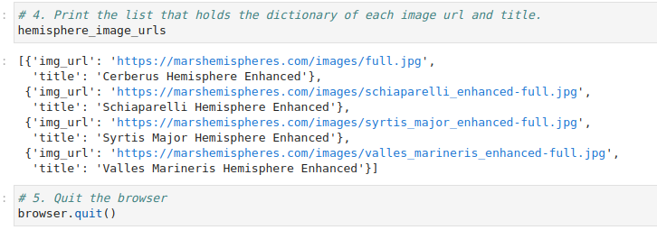
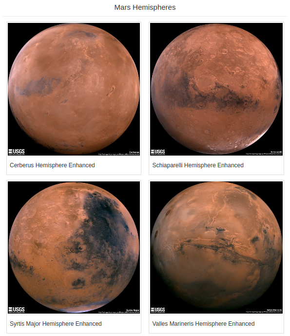
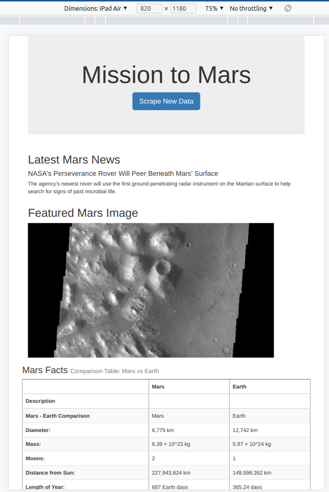

# Mission-to-Mars
Web Scraping with HTML/CSS

## Background
### Purpose

To use BeautifulSoup and Splinter to scrape full-resolution images of Mars’s hemispheres and the titles of those images, store the scraped data on a Mongo database, use a web application to display the data, and alter the design of the web app to accommodate these images.

## Resources

Software:
- Python 3.7.6, Visual Studio Code 1.68.1, MongoDB Compass 1.32.6, HTML/CSS, Flask 2.1.2
 
 

## Overview 
This project consists of three technical analyses:

- Deliverable 1: Scrape Full-Resolution Mars Hemisphere Images and Titles.

- Deliverable 2: Update the Web App with Mars Hemisphere Images and Titles.

- Deliverable 3: Add Bootstrap 3 Components.

 

## Summary of Results
### Deliverable #1

We confirmed that we had the image URLs and titles for all four hemisphere images, and a code to quit the browser (Figure a).

Figure (a) Mars hemisphere images URLs.

 

### Deliverable #2

We were able to scrape all the data, confirm that our webpage had the full-resolution images and the titles of the four hemisphere images, as shown below (Figure b).

Figure (b) Four Mars hemisphere images with titles.
    
 

### Deliverable #3

- We updated our web app to make it mobile-responsive,
    - It was tested for Ipad air and Pixel 4 mobile devices and confirmed that it was functional (Figure c).

Figure (c) Screen capture of the web app mobile version displayed in an ipad screen.  
         
 

- We added two additional Bootstrap 3 components.
    - Table header was increased in size and added a secundary header to the table (Figure d and e).

    
    Figure (d) Screen capture of code adding bootstarp component to table title.

     

    

    Figure (e) Mars facts table after adding bootstrap components.

     

- We modified the Mars Hemisphere images to be displayed in a thumbnail format (Figure f and b).
      
    
    Figure (f) Screen capture of code adding bootstarp component to display images as thumbnail.

    
    
    Figure (g) Four Mars hemisphere images with titles displayed as thumbnail.
        
 

## References

[Markdown](https://docs.github.com/en/get-started/writing-on-github/getting-started-with-writing-and-formatting-on-github/basic-writing-and-formatting-syntax)
 
[Bootstap Grid system](https://getbootstrap.com/docs/3.3/examples/grid/)
 
[Bootstrap CSS](https://getbootstrap.com/docs/3.3/css/)